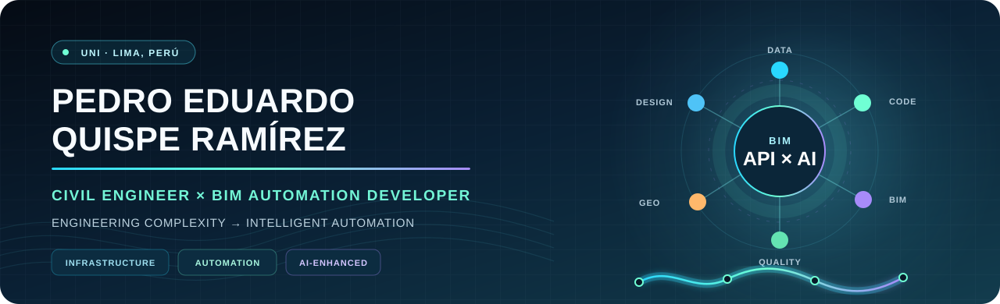
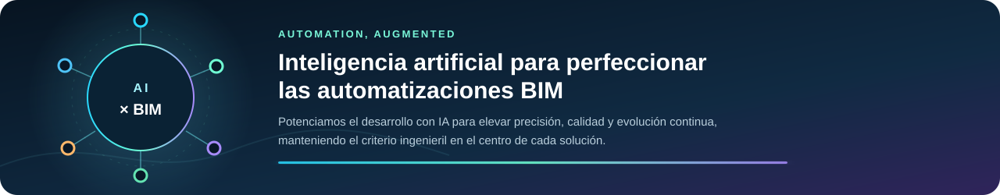
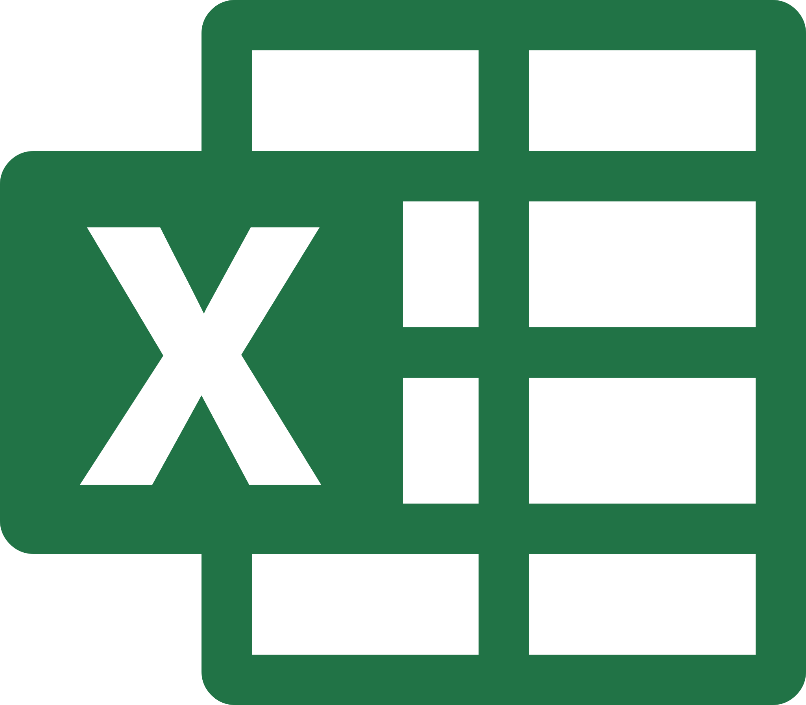

 

### Ingeniería civil, BIM, desarrollo de software e inteligencia artificial en un mismo perfil.

  
  
  
  

**Ingeniero Civil · BIM Developer · Autodesk API Developer · Automation & AI**

*Civil Engineer creating intelligent digital solutions for BIM and infrastructure.*

---

## 👋 Hola, soy Eduardo

Soy **Pedro Eduardo Quispe Ramírez**, Ingeniero Civil formado en la **Universidad Nacional de Ingeniería — UNI, Perú**, apasionado por unir el criterio de la ingeniería con el poder de la programación.

Estoy enfocado en **BIM para infraestructura**, topografía, diseño geométrico y desarrollo de automatizaciones sobre las APIs de **Autodesk Civil 3D** y **Autodesk Revit**. Creo herramientas digitales con **C#, .NET y Python**, conectando modelos BIM, información geoespacial y análisis de datos.

Integramos **inteligencia artificial para perfeccionar las automatizaciones**, elevar su precisión, consistencia y calidad, manteniendo siempre el criterio ingenieril como núcleo de cada solución.

> ### No solo utilizo software para diseñar infraestructura: desarrollo tecnología para transformar cómo la diseñamos.

## Transformo ingeniería compleja en automatización inteligente.

### Menos repetición · Más precisión · Más control · Más tiempo para diseñar

Combino **conocimiento técnico, BIM y desarrollo de software** para convertir desafíos reales de ingeniería en soluciones digitales con impacto.

<table>
  <tr>
    <td align="center" width="25%">
      <h2>🚀</h2>
      <strong>MÁS PRODUCTIVIDAD</strong> 
      Automatizaciones que liberan tiempo valioso del equipo técnico.
    </td>
    <td align="center" width="25%">
      <h2>🎯</h2>
      <strong>MÁS CONFIANZA</strong> 
      Mayor consistencia y control sobre la información del modelo.
    </td>
    <td align="center" width="25%">
      <h2>🧩</h2>
      <strong>SOLUCIONES A MEDIDA</strong> 
      Tecnología alineada con las necesidades de cada flujo BIM.
    </td>
    <td align="center" width="25%">
      <h2>📈</h2>
      <strong>MÁS VALOR DIGITAL</strong> 
      BIM, datos, GIS e IA trabajando como un solo ecosistema.
    </td>
  </tr>
</table>

  <strong>Una combinación difícil de encontrar:</strong> 
  <em>criterio de ingeniería civil + dominio BIM + capacidad de desarrollar software.</em>

## ✦ Áreas de enfoque

<table>
  <tr>
    <td align="center" width="25%">
      <h2>🏗️</h2>
      <strong>BIM para infraestructura</strong> 
      Modelado y coordinación digital para proyectos civiles.
    </td>
    <td align="center" width="25%">
      <h2>⚙️</h2>
      <strong>Autodesk API Development</strong> 
      Automatizaciones nativas para Civil 3D y Revit.
    </td>
    <td align="center" width="25%">
      <h2>🧠</h2>
      <strong>AI-Enhanced Automation</strong> 
      IA aplicada al perfeccionamiento de soluciones técnicas.
    </td>
    <td align="center" width="25%">
      <h2>🌐</h2>
      <strong>Data, BI & GIS</strong> 
      Información técnica convertida en conocimiento útil.
    </td>
  </tr>
</table>

 

## ✦ Ecosistema tecnológico

### Autodesk & BIM

<table>
  <tr>
    <td align="center" width="20%">
       
      <strong>Civil 3D</strong> .NET API
    </td>
    <td align="center" width="20%">
       
      <strong>AutoCAD</strong> .NET API
    </td>
    <td align="center" width="20%">
       
      <strong>InfraWorks</strong> Infraestructura conceptual
    </td>
    <td align="center" width="20%">
       
      <strong>ReCap Pro</strong> Reality capture
    </td>
    <td align="center" width="20%">
       
      <strong>Revit</strong> .NET API
    </td>
  </tr>
</table>

  
  
  

### Development & Automation

<table>
  <tr>
    <td align="center" width="20%">
       
      <strong>C#</strong> Lenguaje principal
    </td>
    <td align="center" width="20%">
       
      <strong>.NET</strong> Plugins y aplicaciones
    </td>
    <td align="center" width="20%">
       
      <strong>Python</strong> Automatización y datos
    </td>
    <td align="center" width="20%">
       
      <strong>Visual Studio</strong> Development IDE
    </td>
    <td align="center" width="20%">
       
      <strong>GitHub</strong> Version control
    </td>
  </tr>
</table>

  
  
  
  

### Data, Business Intelligence & GIS

<table>
  <tr>
    <td align="center" width="20%">
       
      <strong>Excel</strong> Datos técnicos
    </td>
    <td align="center" width="20%">
       
      <strong>Power BI</strong> Visualización
    </td>
    <td align="center" width="20%">
       
      <strong>QGIS</strong> Open-source GIS
    </td>
    <td align="center" width="20%">
       
      <strong>ArcGIS</strong> Geospatial platform
    </td>
    <td align="center" width="20%">
       
      <strong>ArcMap</strong> Cartografía y análisis
    </td>
  </tr>
</table>

## ✦ Mi visión

Desarrollar una ingeniería más conectada, visual e inteligente, donde **BIM, APIs, datos e inteligencia artificial** trabajen juntos para impulsar soluciones de infraestructura con mayor valor técnico.

### ¿Tu equipo está listo para llevar su flujo BIM al siguiente nivel?

Si buscas reducir tareas repetitivas, conectar mejor la información técnica o convertir una necesidad de ingeniería en una herramienta digital, **conversemos**.

#### Engineering the model · Coding the workflow · Enhancing automation with AI

 

  

Autodesk, AutoCAD, Civil 3D, InfraWorks, ReCap y Revit son marcas de Autodesk, Inc. 
Perfil profesional independiente, no afiliado ni patrocinado por Autodesk, Microsoft, Esri u OpenAI.

