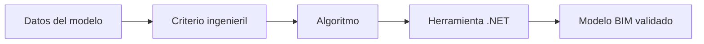

### Convierto procesos de ingeniería civil en herramientas digitales para diseñar mejor, más rápido y con mayor control.

  
  
  
  

**Ingeniero Civil · BIM Developer · Desarrollador de automatizaciones para Autodesk Civil 3D**

*Civil Engineer building software for BIM and infrastructure.*

---

## 👋 Hola, soy Eduardo

Soy **Pedro Eduardo Quispe Ramírez**, Ingeniero Civil formado en la **Universidad Nacional de Ingeniería — UNI, Perú**. Mi trabajo vive en la intersección entre la ingeniería de infraestructura, el modelado BIM y el desarrollo de software.

Me especializo en **topografía y diseño geométrico de infraestructura vial y aeroportuaria**. Además de modelar, desarrollo soluciones con la **API de Autodesk Civil 3D**, **C# y .NET** para transformar operaciones manuales y repetitivas en flujos confiables, trazables y reutilizables.

> **No solo modelo infraestructura: construyo las herramientas que ayudan a modelarla.**

## 🧭 Mi diferencial: ingeniería + software

| Ingeniería civil y BIM | Desarrollo y automatización |
|---|---|
| Alineamientos, perfiles y rasantes | Plugins nativos para Civil 3D |
| Corredores, ensamblajes y subensamblajes | C# · .NET · AutoCAD/Civil 3D API |
| Superficies TIN, grading y movimiento de tierras | Interfaces WPF con arquitectura MVVM |
| Secciones, metrados y análisis geométrico | Dynamo y Python para automatización BIM |
| Topografía, COGO Points y reconstrucción geométrica | Algoritmos, validaciones y procesamiento de datos |
| Coordinación BIM de infraestructura | Git, GitHub y flujos de desarrollo en Visual Studio |

## 🛠️ Tecnologías que utilizo

## 🚧 Lo que construyo

| Solución | Qué problema resuelve | Tecnologías |
|---|---|---|
| **Corridor Section Viewer** | Inspección y análisis interactivo de secciones de corredores y superficies | Civil 3D API · C# · WPF |
| **Surface Topology Tracer** | Reconstrucción de líneas características desde XYZ y triangulación de superficies TIN | Geometría computacional · .NET |
| **Corridor & Baseline Toolkit** | Clonado y gestión de baselines, regiones, targets, frecuencias y assemblies | Civil 3D API · C# |
| **COGO Channel Axis Analyzer** | Detección de secciones topográficas y generación automática del eje 3D de canales | COGO Points · Algoritmos · WPF |
| **Custom Subassemblies** | Lógica paramétrica para soluciones viales y aeroportuarias especializadas | Subassembly Composer |
| **BIM Automation Workflows** | Reducción de tareas repetitivas, control de calidad y procesamiento de información | Dynamo · Python · C# |

## ⚙️ Así convierto una necesidad técnica en una solución

Mi enfoque parte del problema real del proyectista: primero entiendo la geometría, las reglas de diseño y el flujo de trabajo; después construyo una herramienta que pueda probarse dentro del entorno donde el ingeniero trabaja.

## 🔬 En qué estoy enfocado

- Desarrollo de **comandos y extensiones nativas para Autodesk Civil 3D**.
- Automatización de **corredores, superficies, secciones, topografía y metrados**.
- Reconstrucción geométrica a partir de **TinSurface, XYZ y triangulación**, incluso cuando no existen breaklines originales.
- Interfaces profesionales en **WPF/MVVM** para acercar algoritmos complejos al usuario técnico.
- Integración de **BIM, programación e inteligencia artificial**.
- Exploración de **agentes de IA, OpenAI API y MCP** aplicados a flujos de ingeniería.

## 🎯 Mi visión

Impulsar una forma de hacer ingeniería donde el criterio técnico del profesional se combine con software especializado. El objetivo no es automatizar por automatizar: es **reducir errores, recuperar tiempo de ingeniería y tomar mejores decisiones sobre el modelo**.

### ¿Construimos el futuro de la infraestructura digital?

Estoy abierto a colaborar en **Civil 3D, BIM para infraestructura, herramientas .NET, automatización y geometría computacional**.

  

<strong>Engineering the model. Coding the workflow. Automating the future.</strong>

